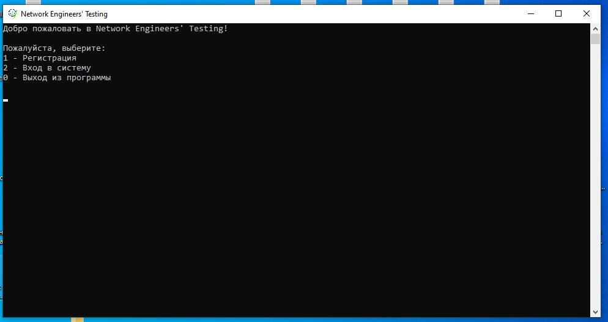
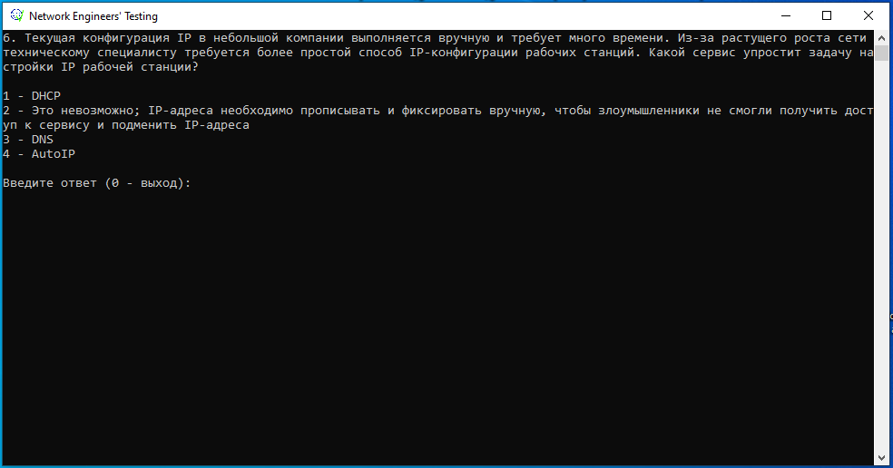
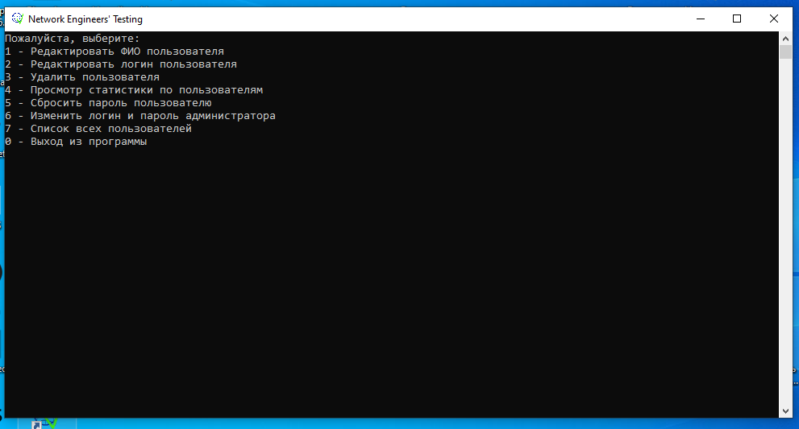

Network Engineers' Testing - экзаменационная работа по предмету "Объектно-ориентированное программирование с использованием языка C++" в Компьютерной Академии ШАГ г. Кривой Рог, представленная 21.02.2022. 
Консольное приложение, предназначенное для проверки знаний начинающих сетевых инженеров. Программа предоставляет режим пользователя, в котором ученик может зарегистрироваться в системе и пройти тестирование и режим администратора, предоставляющий широкий набор функционала по редактированию и контролю данных пользователей. 
В режиме пользователя программа предоставляет ученику три уровня тестирования: 
  <b>1 - Базовые основы компьютерных сетей и владения ПК.</b> Подойдет в качестве подготовки к сертификации Cisco IT Essentials. 
  <b>2 - Основы работы с компьютерными сетями и сетевым оборудованием; Основы коммутации и маршрутизации.</b> Подойдет в качестве подготовки к сертификации Cisco CCNA Introduction to Network. 
  <b>3 - Профессиональный уровень владения сетевым оборудованием и компьютерными сетями; Расширенное изучение принципов коммутации и маршрутизации.</b> Подойдет в качестве подготовки к сертификации Cisco CCNA Routing and Switching. 
 
 

